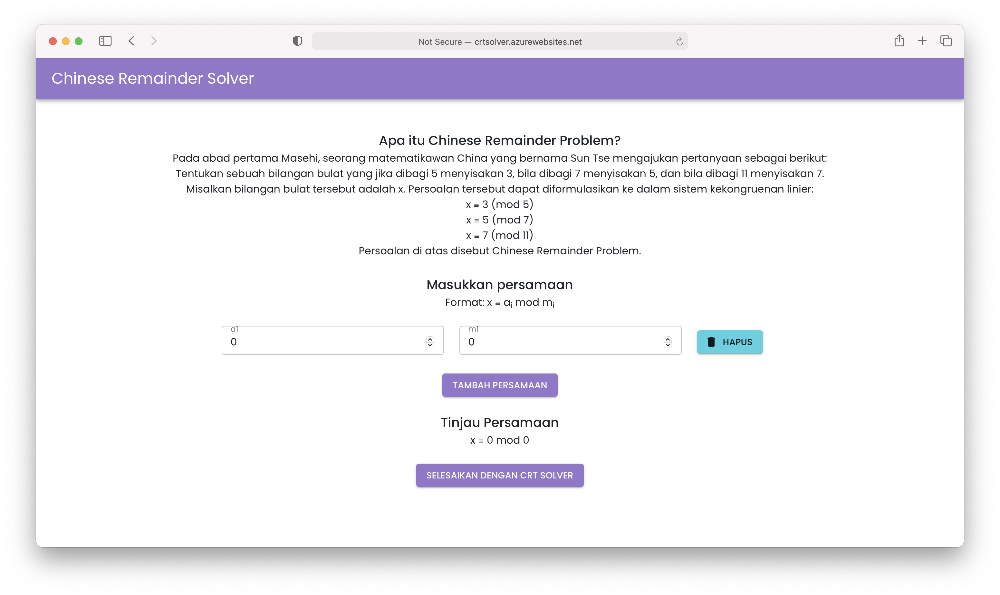
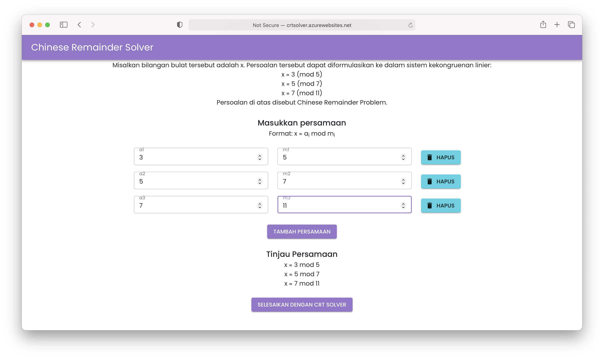
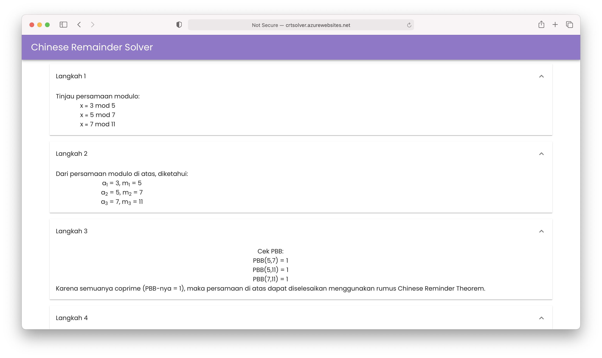
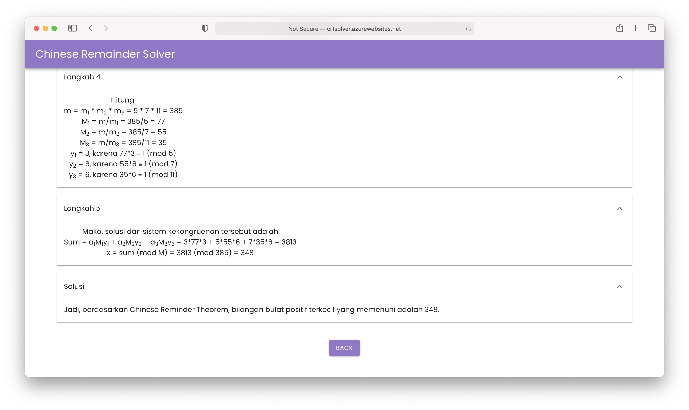

# Chinese Remainder Solver
> Tugas Seleksi Ca-IRK 2019

## Table of contents
  - [General Info](#general-info)
  - [Requirements](#requirements)
  - [Setup](#setup)
  - [How to Use](#how-to-use)
  - [Screenshots](#screenshots)
  - [Created by](#created-by)

## General Info
Program ini merupakan static web app yang dapat menerima masukan sistem kekongruenan linier yang tersusun atas beberapa persamaan modulo, lalu menghitung penyelesaiannya menggunakan teorema Chinese Remainder Theorem.
Program ini dibuat menggunakan library React.js dan Material UI.
## Requirements 
(Jika ingin menjalankan di local)
- Node.js
- Web browser
## Setup 
(Jika ingin menjalankan di local)
1. Clone repository ini
2. Buka terminal di directory penyimpanan yang sesuai
3. Masuk ke folder berisi source code dengan mengetikkan di terminal:
   ```
   cd app
   ```
4. Jalankan program dengan mengetikkan di terminal:
   ```
   npm start
   ```
5. Pergi ke alamat http://localhost:3000/
## How to Use
1. Pergi ke alamat website: https://crtsolver.azurewebsites.net/ 
2. Masukkan persamaan yang diinginkan, klik "Hapus" jika ingin menghapus persamaan, dan "Tambah Persamaan" untuk menambahkan satu persamaan.
3. Lihat persamaan yang telah diinput pada "Tinjau Persamaan", jika sudah ingin submit klik "Selesaikan dengan CRT Solver"
4. Solusi dari persoalan Chinese Remainder Problem akan tampil pada layar dan disertai dengan langkah-langkahnya.

## Screenshots





## Created by
- Shafira Naya Aprisadianti - 13519040 - K-1